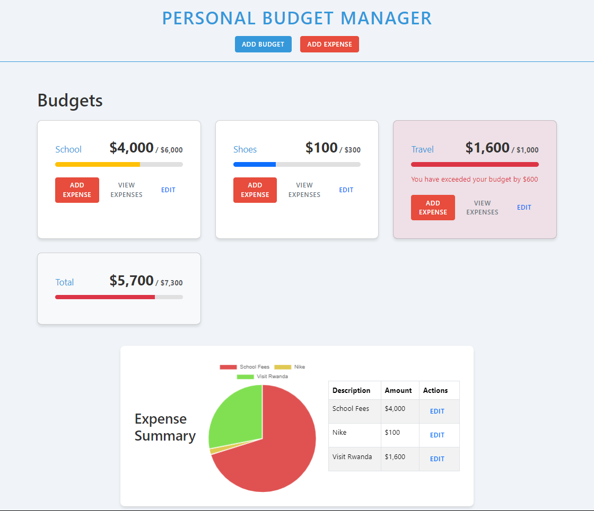

# Personal Budget Manager


## Deployed App on Netlify
[chumz-budget-manager](https://chumz-budget-manager.netlify.app/)

## Description

The Personal Budget Manager is a user-friendly web application designed to help individuals track their expenses and manage their budget effectively. Built with React, this application offers a simple yet powerful interface for adding, updating, and visualizing spending across various categories.

## Core Features

1. **Add Expense:** Easily input details about each expense, including the amount, date, and category.
2. **View Expenses:** Display a comprehensive list of all expenses, with options to filter by date and category.
3. **Edit Expenses:** Edit your expenses.
4. **Delete Expenses:** Delete any expenses.
5. **Edit Budget:** Edit your budget.
6. **Budget Limits:** Set personalized budget limits for each category and receive alerts when approaching these limits.

## Technical Specifications

- **Framework:** React
- **Component Structure:** Functional components with hooks
- **State Management:** Local state management using React's `useState` and `useReducer` for complex state logic
- **Data Flow:** Prop-based data and function passing between components
- **Visualization:** Integrated charting library, Chart.js, for expense summaries

## Getting Started

### Prerequisites

- Node.js (v14.0.0 or later)
- npm (v6.0.0 or later)

### Installation

1. Clone the repository:
   ```
   git clone https://github.com/yourusername/personal-budget-manager.git
   ```

2. Navigate to the project directory:
   ```
   cd personal-budget-manager
   ```

3. Install the dependencies:
   ```
   npm install
   ```

4. Start the development server:
   ```
   npm run dev
   ```

5. Open your browser and visit `http://localhost:5173` to view the application.

## Usage

1. **Adding an Expense:**
   - Click on the "Add Expense" button
   - Fill in the expense details (amount, date, category)
   - Submit the form to add the expense to your tracker

2. **Viewing Expenses:**
   - Navigate to the "Expenses" tab to see a list of all your expenses
   - Use the filter options to sort by date or category

3. **Checking Expense Summary:**
   - Go to the "Summary" tab to view graphical representations of your spending

4. **Setting Budget Limits:**
   - In the "Budget" section, you can set spending limits for each category
   - The application will alert you when you're approaching or exceeding these limits